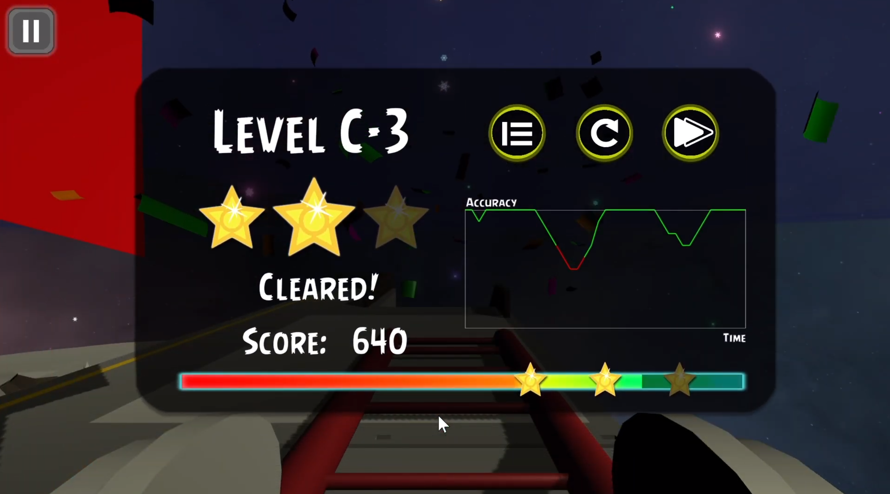

# Functioning-Roller-Coaster

-----------------------------------------------------------------------------------
- This repository only features scripting component right now. 
- This repository is migrated from Unity Collab. 
- See the latest build at https://github.com/AndyTQ/Functioning-Roller-Coaster/releases

# Screenshots
### Tutorial

### Editing a function

### Passing a stage

### Riding the roller coaster

